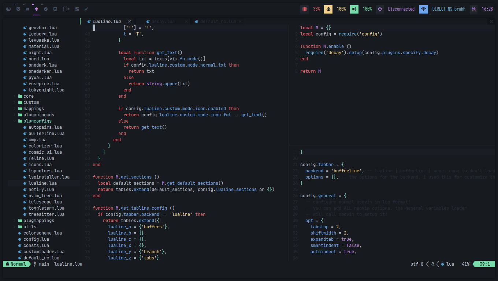

# decay.nvim

This is a port of the [Decay Colorscheme](https://github.com/decaycs) for neovim using lua.



## External plugins support

- Telescope
- Nvim Tree
- Tresitter
- Lsp
- Lsp saga
- Coc
- Bufferline
- Illuminate
- Diff
- Git signs
- Git gutter
- Lualine
- Indent-BlankLine

## Installation

You can use many packages managers available out there, such as packer.nvim, lazy.nvim, etc.

### Lazy

Use the next lua code as reference.

```lua
{
    "decaycs/decay.nvim",
    name = "decay",
    lazy = false,
    priority = true,
    config = function ()
        -- SNIP
    end
}
```

### Packer

Grab the following snippet.

```lua
use {'decaycs/decay.nvim', as = 'decay'}
```

Then execute `:PackerInstall` or `:PackerSync` to install decay.

### Vim plug

Include this in your configuration.

```vim
Plug 'decaycs/decay.nvim', { 'as': 'decay' }
```

### Enable the theme

To enable the theme you can use the `vim.cmd.colorscheme` function or `vim.cmd [[ colorscheme * ]]` if you're using
an older version of neovim.

So being the available palettes: dark decay, default decay, light decay, and decayce, you can do:

```lua
vim.cmd.colorscheme "decay-dark"
vim.cmd.colorscheme "decay-light"
vim.cmd.colorscheme "decay-default"
vim.cmd.colorscheme "decayce"
```

#### Customising decay

You can customise decay behavior by using the `.setup` function and also calling the colorscheme setting.

```lua
local decay = require("decay")

local opt = vim.opt
local cmd = vim.cmd

opt.background = "light"

decay.setup({
  style = "default",

  -- enables italics in code keywords & comments.
  italics = {
    code = true,
    comments = true,
  },

  -- enables contrast when using nvim tree.
  nvim_tree = {
    contrast = true
  },
})

cmd.colorscheme "decay"
```

Note that in this example we've used "decay" as colorscheme instead of "decay-STYLE"... This is
because we're already setting the style with the `.setup` method instead.

> [!TIP]
> Using `vim.opt.background` enables light decay! no matter what palette you've choosen.
> Setting background is always recommended though, even to "dark", so, be careful.

## Cmp.nvim

By default this theme will create some kind of highlighted blocks in the cmp menu,
but you can disable them by adding the following code snippet in your setup block.

```lua
require('decay').setup {
  -- SNIP
  cmp = {
    block_kind = false,
  },
}
```

## Lualine

If you use lualine, you can enable the integration with this:

```lua
require('lualine').setup {
  options = {
    theme = 'decay',
  },
}
```

## Getting the colors

You can fetch the colors of a specific palette by using the `core` module.

```lua
local core = require 'decay.core'

 -- style could be: default, dark, decayce or cosmic (experimental).
 -- note that if vim.opt.background is light, even setting the palette will
 -- anyways return the light palette.
local STYLE = "dark" -- e.g
local colors = core.get_colors(STYLE)

print(colors.background) -- shows the background of the selected palette!
```

## Overriding colors

You can override certain highlights according to your needs, take the next code as reference
to do so.

```lua
local decay = require("decay")
local core = require("decay.core")

-- choose an style to fetch the colors
local STYLE = "decayce"
local colors = core.get_colors(STYLE)

decay.setup({
  style = style,
  cmp = { block_kind = false },
  nvim_tree = { contrast = true },
  italics = {
    code = true,
    comments = true,
  },
  -- overriding the `@property` highlight used by treesitter and using the red color instead.
  override = {
    ["@property"] = { fg = colors.red },
  }
})
```

And if you want, you can also override the palette instead of specific highlights, e.g:

```lua
local decay = require("decay")
local core = require("decay.core")

-- chose a decay style.
local STYLE = "decayce"
local colors = core.get_colors(STYLE)

decay.setup {
  style = style,
  cmp = { block_kind = true },
  nvim_tree = { contrast = true },
  italics = {
    code = true,
    comments = true,
  },
  palette_overrides = {
    background = "#191C1C",
    contrast = "#161919",
    statusline_bg = "#222626",
    lighter = "#2f3434",
    foreground = "#B1CCC9",
    cursorline = "#2f3434",
    comments = "#3F4947",
    cursor = "#B1CCC9",
    black = "#2D3130",
    red = "#e88693",
    green = "#4FDAD1",
    yellow = "#ecd3a0",
    blue = "#97b1e2",
    magenta = "#caabe6",
    cyan = "#93cee9",
    white = "#cbced3",
    brightblack = "#2f3434",
    brightred = "#e88693",
    brightgreen = "#4FDAD1",
    brightyellow = "#ecd3a0",
    brightblue = "#97b1e2",
    brightmagenta = "#caabe6",
    brightcyan = "#98d3ee",
    brightwhite = "#B1CCC9",
    accent = "#4FDAD1",
  }
}
```

> ![TIP]
> Check [core.lua](./lua/decay/core.lua) to see an actual list of attributes specifying palette colors when using `palette_overrides`.
